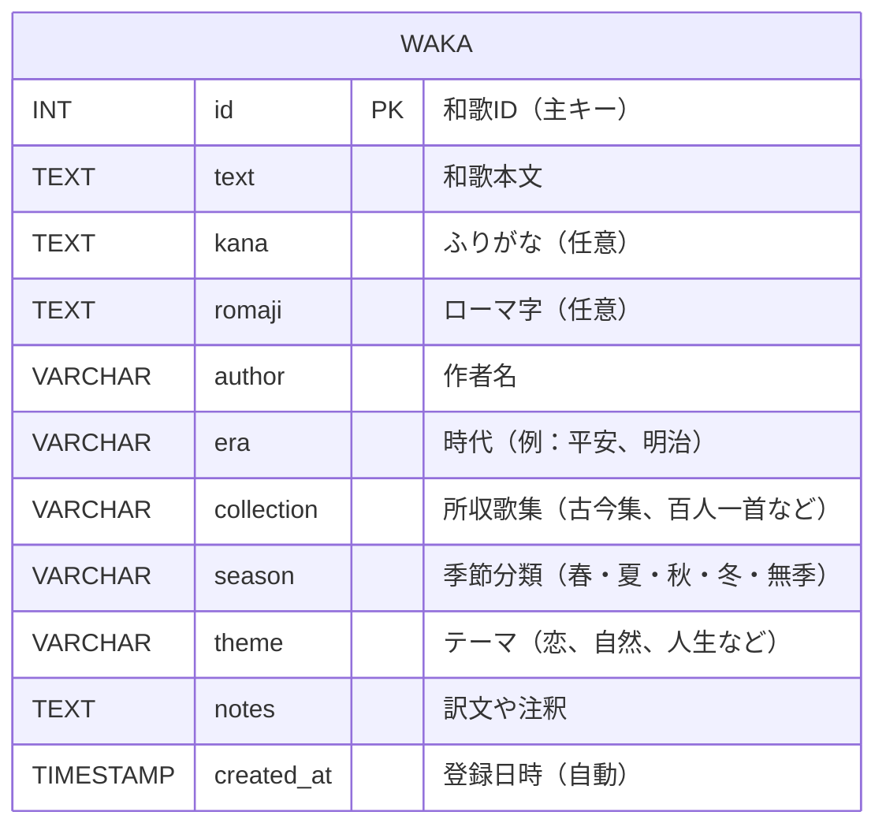
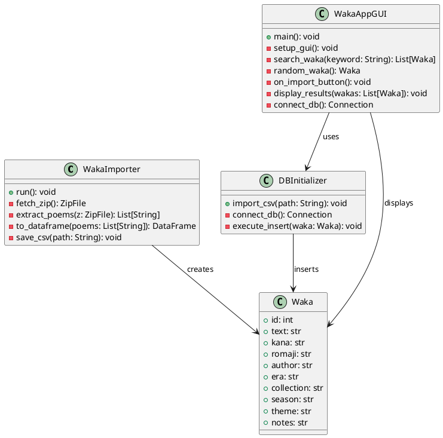

# 和歌俳句データベース

プログラミングの課題
1万以上のレコードがあるデータベース(postgresなど)を使用するアプリケーション(基本GUI)(おそらくAPIとかでも良さそう)を作成せよ
提出はデータベースの中身(コアダンブ？)とhtmlのレポート付き
期限は7/21 23:59

まずは企画書や設計をしてほしい
プログラムにはデータベースの初期化が含まれると嬉しい

万葉集・百人一首・近代短歌（作者・時代・内容・季語・ジャンル）
件数：歌集・句集あわせて1万以上確保可能
GUI案：全文検索、季語から検索、ランダム俳句表示
被りにくさ：国文学系は意外と狙い目、自然言語処理と組み合わせても面白い

- 出典元
    
    **1.国文学研究資料館（国文研）公開DB**
    
    📍 [https://www.nijl.ac.jp/pages/database/](https://www.nijl.ac.jp/pages/database/)
    
    •	万葉集・古今和歌集・新古今和歌集などを網羅
    
    •	特に「和歌索引DB」や「和歌大成」などが強力
    
    •	多くがCSV形式 or Web上で機械取得可能
    
    •	データ構造：和歌・作者・出典・時代など
    
    **2. 青空文庫**
    
    📍 [https://www.aozora.gr.jp/](https://www.aozora.gr.jp/)
    
    •	近代短歌（与謝野晶子・石川啄木など）の宝庫
    
    •	全文TXT形式で機械処理が可能
    
    •	Pythonでスクレイピング＋整形すれば大量に抽出可
    
    •	テキスト構造例：みだれ髪　与謝野晶子
    
    やは肌の あつき血汐に ふれも見で さびしからずや 道を説く君
    

| **項目** | **内容** |
| --- | --- |
| アプリ形態 | GUIデスクトップアプリ（ローカル実行） |
| 使用DB | PostgreSQL（1万件以上の和歌） |
| 必須機能 | データベースの初期化（1万首を投入） |
| GUI要件 | 最低限の検索・表示でOK（Tkinter等） |
| 提出物 | DBダンプ（.sql）、HTMLレポート、プログラムコード |
| 出典 | 国文研・青空文庫 |

| **操作画面** | **機能** |
| --- | --- |
| 起動画面 | 「和歌データベースを初期化」ボタン付き |
| 検索欄 | キーワード入力欄＋検索ボタン |
| 表示欄 | 和歌一覧（本文＋作者＋出典など）を表示 |
| ランダム表示 | ランダム1首表示ボタン |

| **項目** | **使用内容** |
| --- | --- |
| データベース | PostgreSQL（wakaテーブル） |
| GUI | Python + Tkinter |
| 初期化機能 | CSV → Python → DB投入 |
| 提出ファイル | コアダンプ（.sql）、レポート（HTML） |
| 出典 | 国文学研究資料館、青空文庫 |
- 提出ファイル構成例

```
    waka_app/
    ├── app_gui.py          # GUIデスクトップアプリ（Tkinter）
    ├── import_waka.py      # データベース初期化スクリプト
    ├── waka.csv            # 和歌1万首のデータ（出典付き）
    ├── waka_dump.sql       # PostgreSQLダンプファイル
    ├── report.html         # 提出用HTMLレポート
    ├── [README.md](http://readme.md/)           # 実行手順
```
    



- 和歌テーブル定義
    
    ```sql
    CREATE TABLE waka (
      id SERIAL PRIMARY KEY,
      text TEXT NOT NULL,
      kana TEXT,
      romaji TEXT,
      author VARCHAR(100),
      era VARCHAR(50),
      collection VARCHAR(100),
      season VARCHAR(20),
      theme VARCHAR(50),
      notes TEXT,
      created_at TIMESTAMP DEFAULT CURRENT_TIMESTAMP
    );
    ```


full_app_package/
├── full_auto_manyoshu.py      # 万葉集取得 → waka_manyoshu.csv
├── aozora_auto_tanka.py       # 青空文庫取得 → waka_aozora.csv
├── merge_waka.py              # CSV統合 → waka.csv
├── import_and_gui.py          # CSV生成・DB投入・GUI一体版
├── waka_dump.sql              # （実行後生成される）PostgreSQLダンプ
├── report.html                # HTMLレポート（構成＆スクショ入り）
├── requirements.txt           # 必要パッケージ一覧
└── README.md                  # 実行手順
